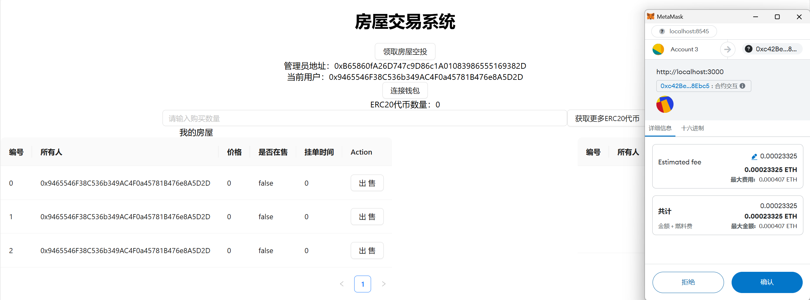

# BC_lab2

《区块链与数字货币》lab2 作业： 房屋交易系统

姓名：王昊元

学号：3220105114

---

## 概述

作业以智能合约（contract）为后端，React为前端，搭建了一个简单房屋交易系统，其具体功能（包括Bonus）包括：

- 用户可申请空投房屋（3座房屋，仅可申请一次）
- 用户可查看拥有的房屋信息
- 用户可对拥有的、未挂单的房屋进行挂单出售
- 用户可查看可购买的房屋
- 用户可对非拥有的、已挂单的房屋进行购买
  - 通过ETH购买
  - 通过ERC20代币购买
- 用户可通过ETH兑换ERC20代币（1:1兑换）

实现逻辑：

- 后端：通过三个合约共同完成：
  - BuyMyRoom.sol：主要合约，基本功能的集合
  - MyERC721.sol：辅助合约，帮助BuyMyRoom实现ERC721类相关管理
  - MyERC20.sol：辅助合约，帮助BuyMyRoom实现ERC20类相关管理
- 前端：通过单个页面完成，使用ant design作为组件库

## 运行方法（本地ganache环境）

1. 克隆本仓库：`git clone https://github.com/falling-leaf/BC_lab2.git`
2. 在ganache中新建本地区块链网络（端口设置为8545），并确定某个账户作为合约部署者（管理员），记录其私钥。
3. 配置后端环境并编译、部署（注意保持ganache网络运行）：

```
cd contracts

npm install hardhat

\\ 在hardhat.config.js中配置网络信息（将accounts字段替换为2中记录的私钥地址）

npx hardhat compile

npx hardhat run scripts/deploy.ts --network ganache

\\ 记录该处输出的'BuyMyRoom'、'erc20'部署地址

```

4. 配置前端环境并启动：

```
cd frontend

npm install

\\ 在src/utils/contract-addresses.json中，将'BuyMyRoom'、'erc20'部署地址更换为3中记录的地址

npm start

```

5. 在浏览器中安装插件**Metamask**，并将网络连接至 `http://localhost:8545`；并根据需要导入账户私钥。
6. 在前端页面中开始使用。

## 结果截图

### 1. 运行

按照上述方法可成功运行：

- `npx hardhat compile`后的输出：


- `npx hardhat run scripts/deploy.ts --network ganache`后的输出：


- 前端运行`npm start`后的输出：


### 2. 交互

#### 2.1 申请空投房屋

1. 点击“申请空投房屋”按钮，弹出申请窗口。


2. 确认后，账户获取到了对应的房屋资源：


#### 2.2 出售房屋

1. 选中某个房屋，点击“出售”按钮，弹出定价窗口：


2. 确定后，弹出交易确认窗口：



3. 确定后，可见房屋状态正确变化：


